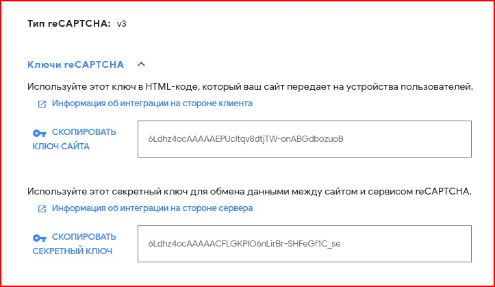

# Recaptcha V3

* [Официальная документация Google](https://developers.google.com/recaptcha/docs/v3).

* [Получить ключи](https://www.google.com/recaptcha/admin/create).

## Ключи


Ключ сайта необходим для скрипта JS.

Добавьте в ```<head></head>``` сайта следующий мета тег с ключом сайта:
```html
<meta name="recaptcha-public-key" content="Ключ сайта">
```

## Установка

1. Для начала закачиваем исходники в CMS. [sRecaptcha.php](src/extensions/Recaptcha/Recaptcha.php) необходимо загрузить в папку /cms/extensions/. JS в любую папку.

2. На страницу, где форма, необходимо установить скрипт.
```html
<scrpt src="/assets/js/recaptcha.js"></scrpt> 
```

3. На необходимую форму необходимо повесить тег: **data-recaptcha**
```html
<form data-recaptcha></form>
```

*В данной форме после проверки рекаптчей должно появится скрытое поле **recaptcha_token***.


## Настройка модуля 
Чтобы произвести проверку на спам, необходимо в *нужном модуле* произвести следующие настройки:
1. Добавить поле которое будет отвечать за проверку на спам. Выводить в форме на сайте нет необходимости.


2. Сделать поле **обязательным**, и добавить код проверки.

***secret key*** - подствьте ключ из поля *секретный ключ*.
```php
$recaptcha = new \Recaptcha\Recaptcha('secret key');

$error = $recaptcha->check(0.5, $_POST['recaptcha_token']);

$f_value = $recaptcha->response;
$f_value .= PHP_EOL . PHP_EOL;
$f_value .= print_r($_POST, 1); 
```


