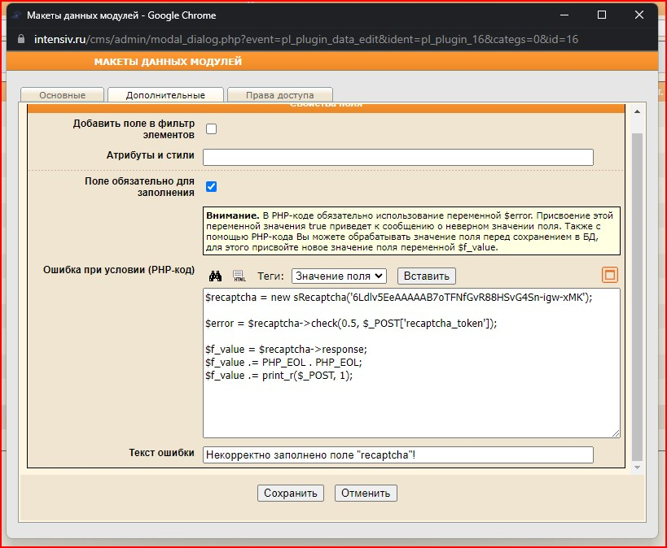

# Recaptcha V3

* [Официальная документация Google](https://developers.google.com/recaptcha/docs/v3).

* [Получить ключи](https://www.google.com/recaptcha/admin/create).

## Требования

* PHP >= 5.3.

## Ключи


Ключ сайта необходим для скрипта JS.

Добавьте в ```<head></head>``` сайта следующий мета тег с ключом сайта:

```html

<meta name="recaptcha-public-key" content="Ключ сайта">
```

## Установка

1. Для начала закачиваем исходники в CMS. Папку `extensions` необходимо необходимо загрузить в папку `/cms`.

4. На страницу, где форма, необходимо установить скрипт.

```html

<script src="/assets/js/recaptcha.js" defer></script> 
```

3. На необходимую форму необходимо повесить тег: **data-recaptcha**

```html

<form data-recaptcha></form>
```

*В данной форме после проверки рекаптчей должно появится скрытое поле **recaptcha_token***.


## Настройка модуля

Чтобы произвести проверку на спам, необходимо в *нужном модуле* произвести следующие настройки:

1. Добавить поле которое будет отвечать за проверку на спам. Выводить в форме на сайте нет необходимости.
   


2. Сделать поле **обязательным**, и добавить код проверки.

***secret key*** - подставьте ключ из поля *секретный ключ*.

```php
if(empty($_POST['recaptcha_token']) && !class_exists('\Recaptcha\Recaptcha')) {
    $error = true;
} else {
    $recaptcha = new \Recaptcha\Recaptcha('secret key');

    // Вариант 1
    $error = $recaptcha->check(0.5, $_POST['recaptcha_token']);
    // Вариант 2, проверка пост поля происходит в методе.
    $error = $recaptcha->checkFromPost(0.5);

    $f_value = $recaptcha->response;
    $f_value .= PHP_EOL . PHP_EOL;
    $f_value .= print_r($_POST, 1); 
}
```




